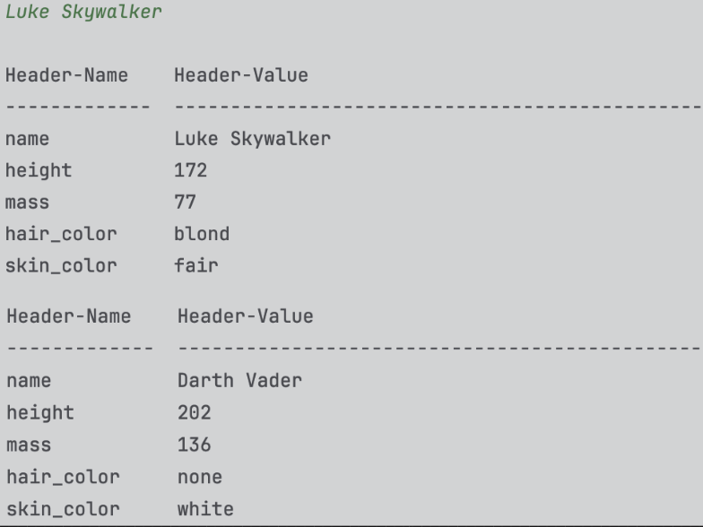

### Star-Wars Documentation

| ENV | Version |
| --- | --- |
| Python | 3.9 |
| requests | 2.32.2 |
| tabulate | 0.9.9 |

Currently, tabulate library is not used, this is why the code is commented. 
The plan is to use it in the future. 
Tabulate is a pretty-print library.

Ref:
* https://pypi.org/project/tabulate/

Star Wars query script:  
Luke Skywalker | Darth Vader  

